# ApexFlow AI: Master ERD

This is a conceptual master ERD for the target architecture. It illustrates principal domain relationships and is not an implementation migration or a complete physical schema.

```mermaid
erDiagram
    ORGANIZATION ||--o{ DEPARTMENT : contains
    DEPARTMENT ||--o{ PROGRAM : owns
    ORGANIZATION ||--o{ USER : scopes
    USER ||--o{ POSITION_ASSIGNMENT : holds
    POSITION ||--o{ POSITION_ASSIGNMENT : assigned
    USER ||--o{ PROGRAM_MEMBERSHIP : joins
    PROGRAM ||--o{ PROGRAM_MEMBERSHIP : includes
    USER ||--o{ COORDINATOR_ASSIGNMENT : holds
    USER ||--o{ REPORTING_RELATIONSHIP : report
    USER ||--o{ REPORTING_RELATIONSHIP : manager

    PROGRAM ||--o{ BATCH : admits
    BATCH ||--o{ SECTION : contains
    ACADEMIC_YEAR ||--o{ ACADEMIC_PERIOD : contains
    PROGRAM ||--o{ SUBJECT : includes
    ACADEMIC_PERIOD ||--o{ SUBJECT : offers
    USER ||--o{ FACULTY_ASSIGNMENT : teaches
    SUBJECT ||--o{ FACULTY_ASSIGNMENT : assigned
    BATCH ||--o{ FACULTY_ASSIGNMENT : receives
    SUBJECT ||--o{ COURSE_OUTCOME : defines
    PROGRAM ||--o{ PROGRAM_OUTCOME : defines

    COMMUNICATION_SOURCE ||--o{ WORK_REQUEST : originates
    WORK_REQUEST ||--o{ AI_EXTRACTION : has
    WORK_REQUEST ||--o{ TASK : creates
    TASK o|--o{ TASK : parent
    TASK ||--o{ TASK_PARTICIPANT : has
    USER ||--o{ TASK_PARTICIPANT : participates
    TASK ||--o{ TASK_DEPENDENCY : successor
    TASK ||--o{ ACTIVITY_EVENT : records
    WORKFLOW_DEFINITION ||--o{ WORKFLOW_DEFINITION_VERSION : versions
    WORKFLOW_DEFINITION_VERSION ||--o{ WORKFLOW_INSTANCE : runs
    TASK ||--o| WORKFLOW_INSTANCE : governs
    WORKFLOW_INSTANCE ||--o{ WORKFLOW_TRANSITION : records
    WORKFLOW_INSTANCE ||--o{ APPROVAL_DECISION : receives

    COMMUNICATION_SOURCE ||--o{ EMAIL_MESSAGE : represents
    COMMUNICATION_SOURCE ||--o{ CALENDAR_EVENT : represents
    COMMUNICATION_SOURCE ||--o{ DOCUMENT : represents
    COMMUNICATION_SOURCE ||--o{ ATTACHMENT : supplies
    TASK ||--o{ ATTACHMENT : links
    COMMUNICATION_SOURCE ||--o{ KNOWLEDGE_ENTITY : projects
    TASK ||--o{ KNOWLEDGE_ENTITY : projects
    KNOWLEDGE_ENTITY ||--o{ KNOWLEDGE_RELATIONSHIP : source
    KNOWLEDGE_ENTITY ||--o{ KNOWLEDGE_RELATIONSHIP : target

    ORGANIZATION { uuid id PK string slug UK }
    DEPARTMENT { uuid id PK uuid organization_id FK string code }
    PROGRAM { uuid id PK uuid department_id FK string code }
    USER { uuid id PK uuid organization_id FK string email UK }
    POSITION { uuid id PK string code UK int authority_level }
    POSITION_ASSIGNMENT { uuid id PK uuid user_id FK uuid position_id FK }
    PROGRAM_MEMBERSHIP { uuid id PK uuid user_id FK uuid program_id FK }
    COORDINATOR_ASSIGNMENT { uuid id PK uuid user_id FK uuid program_id FK }
    REPORTING_RELATIONSHIP { uuid id PK uuid report_user_id FK uuid manager_user_id FK }
    ACADEMIC_YEAR { uuid id PK string code }
    ACADEMIC_PERIOD { uuid id PK uuid academic_year_id FK int sequence }
    BATCH { uuid id PK uuid program_id FK string code }
    SECTION { uuid id PK uuid batch_id FK string code }
    SUBJECT { uuid id PK uuid program_id FK uuid academic_period_id FK string code }
    FACULTY_ASSIGNMENT { uuid id PK uuid user_id FK uuid subject_id FK uuid batch_id FK }
    COURSE_OUTCOME { uuid id PK uuid subject_id FK string code }
    PROGRAM_OUTCOME { uuid id PK uuid program_id FK string code }
    COMMUNICATION_SOURCE { uuid id PK string external_source string external_id }
    WORK_REQUEST { uuid id PK uuid communication_source_id FK string status }
    AI_EXTRACTION { uuid id PK uuid work_request_id FK decimal confidence }
    TASK { uuid id PK uuid work_request_id FK uuid parent_task_id FK string status }
    TASK_PARTICIPANT { uuid id PK uuid task_id FK uuid user_id FK string role }
    TASK_DEPENDENCY { uuid id PK uuid predecessor_task_id FK uuid successor_task_id FK }
    ACTIVITY_EVENT { uuid id PK uuid task_id FK string event_type }
    WORKFLOW_DEFINITION { uuid id PK string code UK }
    WORKFLOW_DEFINITION_VERSION { uuid id PK uuid workflow_definition_id FK int version_number }
    WORKFLOW_INSTANCE { uuid id PK uuid definition_version_id FK uuid resource_id string current_state }
    WORKFLOW_TRANSITION { uuid id PK uuid workflow_instance_id FK string to_state }
    APPROVAL_DECISION { uuid id PK uuid workflow_instance_id FK uuid approver_user_id FK string decision }
    EMAIL_MESSAGE { uuid id PK uuid communication_source_id FK string external_message_id }
    CALENDAR_EVENT { uuid id PK uuid communication_source_id FK string external_event_id }
    DOCUMENT { uuid id PK uuid communication_source_id FK string external_document_id }
    ATTACHMENT { uuid id PK uuid communication_source_id FK string checksum }
    KNOWLEDGE_ENTITY { uuid id PK string entity_type uuid source_entity_id }
    KNOWLEDGE_RELATIONSHIP { uuid id PK uuid from_entity_id FK uuid to_entity_id FK string relationship_type }
```

## Relationship Notes

- Tenant-scoped entities are rooted at `organization` directly or through an owning parent and also carry `organization_id` where required for safety and query scope.
- Work records preserve communication provenance but are valid for manual and API-created sources as well.
- Workflow instances are polymorphically associated with governed resources; the task relationship shown is the common case.
- Knowledge entities and relationships are projections with provenance, not replacements for transactional source tables.
