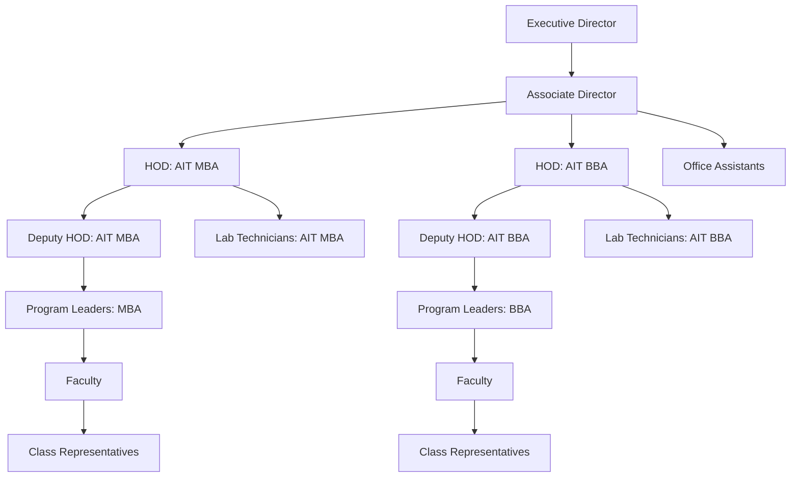
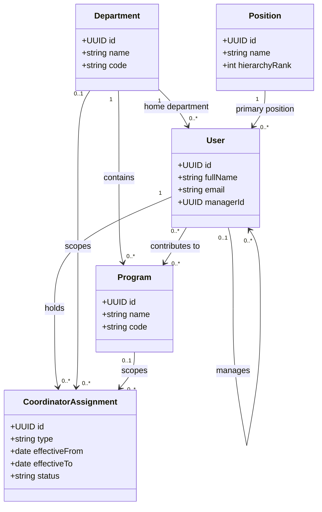

# Apex Institute of Management: Organization Structure

This document defines the organizational domain for Apex Institute of Management (AIM). It is a business design reference only; it does not prescribe or introduce implementation changes.

## 1. Institute Overview

Apex Institute of Management is an academic institution that delivers management education through two departments:

- **AIT MBA** — responsible for postgraduate management education and its MBA specializations.
- **AIT BBA** — responsible for undergraduate business education and its BBA specializations.

The institute's structure separates executive governance, academic leadership, program delivery, faculty work, student representation, and operational support. This enables a consistent management chain while allowing faculty to contribute across programs and hold time-bound coordinator assignments.

## 2. Organizational Hierarchy

The principal academic reporting chain is:

```text
Executive Director
        ↓
Associate Director
        ↓
HOD
        ↓
Deputy HOD
        ↓
Program Leader
        ↓
Faculty
        ↓
Class Representative
```

Office Assistants report to the **Associate Director** for administration and operational support. Lab Technicians report to the relevant **HOD** for laboratory and academic-resource support. These support positions may serve more than one program, but each person has one primary reporting manager.

## 3. Departments

### AIT MBA

**Purpose:** Deliver postgraduate management education and maintain the academic quality, industry relevance, and outcomes of MBA programs.

**Responsibilities:**

- Plan and deliver MBA curriculum, assessments, and academic calendars.
- Govern MBA program specializations and program-level outcomes.
- Coordinate faculty allocation, student support, research, industry engagement, and placement activities for MBA learners.

### AIT BBA

**Purpose:** Deliver undergraduate business education and build the academic and professional foundations of BBA students.

**Responsibilities:**

- Plan and deliver BBA curriculum, assessments, and academic calendars.
- Govern BBA program specializations and program-level outcomes.
- Coordinate faculty allocation, student support, industry exposure, and placement-readiness activities for BBA learners.

## 4. Programs

Programs belong to one department. A program is the academic-delivery unit through which its curriculum, learners, faculty participation, and program leadership are coordinated.

### MBA programs (AIT MBA)

- Business Analytics
- Data Science & AI
- Strategic HR
- Healthcare & Hospital Management
- AI for Business
- Digital Marketing
- BFSI
- FinTech
- Logistics & Supply Chain

### BBA programs (AIT BBA)

- Business Analytics
- Data Science & AI
- Strategic HR
- Digital Marketing
- FinTech
- Logistics & Supply Chain

## 5. Positions

Positions establish the primary organization and reporting structure. They are distinct from system roles and permissions, which are assigned to users according to institutional policy.

### Executive Director

- **Responsibilities:** Set institute strategy, approve policy and institutional priorities, and provide final executive oversight.
- **Reports To:** The institute's governing authority or board, where represented in the system.
- **Can Manage:** Associate Director; institute-wide leadership and escalated institutional matters.
- **System Permissions (high level):** Institute-wide visibility; approve and govern organization, academic, workflow, and reporting activities; delegate authority.

### Associate Director

- **Responsibilities:** Translate executive direction into institute operations; coordinate departments; oversee administration and cross-department delivery.
- **Reports To:** Executive Director.
- **Can Manage:** HODs and Office Assistants; may coordinate institute-wide initiatives.
- **System Permissions (high level):** Read institute-wide information; manage delegated organization, academic operations, staffing coordination, and workflows.

### HOD

- **Responsibilities:** Lead one department, ensure academic quality, allocate departmental work, and own departmental performance.
- **Reports To:** Associate Director.
- **Can Manage:** Deputy HODs, Program Leaders, Faculty, and Lab Technicians in the department.
- **System Permissions (high level):** Manage departmental programs, academic activities, resources, and reports; view department members and relevant institute information.

### Deputy HOD

- **Responsibilities:** Support the HOD, supervise delegated departmental operations, and act for the HOD when authorized.
- **Reports To:** HOD.
- **Can Manage:** Program Leaders and Faculty within delegated scope.
- **System Permissions (high level):** Manage delegated department operations; view departmental data and reports; approve or route assigned work.

### Program Leader

- **Responsibilities:** Lead academic delivery for an assigned program, coordinate its faculty and class representatives, and monitor program outcomes.
- **Reports To:** Deputy HOD.
- **Can Manage:** Faculty and Class Representatives assigned to the program.
- **System Permissions (high level):** Manage assigned program data, academic coordination, and program reports; view participating faculty and learners.

### Faculty

- **Responsibilities:** Teach, assess, mentor learners, contribute to curriculum and institutional work, and perform assigned coordinator duties.
- **Reports To:** Program Leader.
- **Can Manage:** Class Representatives only when specifically assigned responsibility for a class or program activity.
- **System Permissions (high level):** Access assigned department and program information; manage teaching, assessment, mentoring, and assigned coordinator work.

### Office Assistant

- **Responsibilities:** Provide administrative support, maintain records, coordinate communications, and support office processes.
- **Reports To:** Associate Director.
- **Can Manage:** No academic positions; may coordinate administrative tasks without changing reporting authority.
- **System Permissions (high level):** Access and manage assigned administrative records and workflows; no academic-governance permissions by default.

### Lab Technician

- **Responsibilities:** Maintain laboratory facilities and equipment, support practical sessions, and manage technical inventory and safety processes.
- **Reports To:** HOD of the department served.
- **Can Manage:** No academic positions; may coordinate lab access and technical tasks.
- **System Permissions (high level):** Access assigned laboratory, inventory, support-ticket, and timetable information; no academic-governance permissions by default.

### Class Representative

- **Responsibilities:** Represent the class, communicate learner feedback and notices, and support coordination between learners and faculty.
- **Reports To:** Faculty member assigned to the class or program activity.
- **Can Manage:** No positions.
- **System Permissions (high level):** View relevant class notices and submit feedback or requests; no access to staff management, academic records, or governance functions by default.

## 6. Reporting Hierarchy

Each user has exactly one primary reporting manager. The standard relationships are:

| Report | Primary manager |
| --- | --- |
| Executive Director | Governing authority or board (if represented) |
| Associate Director | Executive Director |
| HOD | Associate Director |
| Deputy HOD | HOD |
| Program Leader | Deputy HOD |
| Faculty | Program Leader |
| Office Assistant | Associate Director |
| Lab Technician | HOD of the served department |
| Class Representative | Assigned Faculty member |

Temporary work coordination, project participation, and coordinator assignments do not create an additional reporting manager. Delegated approval authority must preserve the user's primary reporting line.

## 7. Coordinator Assignments

A **Coordinator** is not a position or an organizational role. It is a named assignment held by a faculty member in addition to their faculty position. One faculty member may hold multiple coordinator assignments at the same time, and each assignment may be scoped to the institute, a department, or a program.

Coordinator assignment types are:

- Exam
- Research
- ERP
- OBE
- Admission
- Timetable
- MOOC
- Placement
- Alumni
- Industry Relations
- Event
- Website
- Social Responsibility
- Admin
- IQAC

Assignments should record their scope, effective period, appointing authority, and status. They can be reassigned or ended each semester without changing the faculty member's position, department, or primary reporting manager.

## 8. Business Rules

- Each program belongs to exactly one department.
- One faculty member can belong to and contribute to multiple programs while retaining one home department.
- Program Leaders are faculty members with a program-leadership position assignment; they are not a separate person type.
- One faculty member can hold multiple coordinator assignments simultaneously.
- Coordinator assignments can change every semester and do not change primary reporting lines.
- Every user belongs to exactly one department, including support and leadership users; institute-wide users use their designated home department for this purpose.
- Every user has exactly one primary reporting manager. The Executive Director's manager is the governing authority when it is represented; otherwise that external relationship is recorded as an institutional reference rather than a second internal manager.
- A person may hold only one primary position at a time, except that Program Leader remains a faculty member for academic participation.
- System permissions are granted through authorization policy, not inferred solely from a position or coordinator assignment.
- A Class Representative is a student-facing representation assignment and cannot manage staff positions.

## 9. Mermaid Organization Chart



## 10. Mermaid Class Diagram



## 11. Future Extensibility

This design provides a stable organizational core for future modules:

- **ERP:** Department, program, primary position, and reporting data can scope records, approvals, assets, attendance, examinations, and staff directories.
- **AI:** Clear organizational context enables role-aware assistants, program-specific insights, responsible data access, and escalation to the correct manager.
- **Workflows:** Reporting lines establish default approvers, while coordinator assignments provide time-bound routing for specialized processes such as exams, OBE, admissions, and IQAC.
- **Growth:** New departments, programs, coordinator types, positions, or support functions can be added without changing the principles of one home department, one primary manager, and assignment-based coordination.
