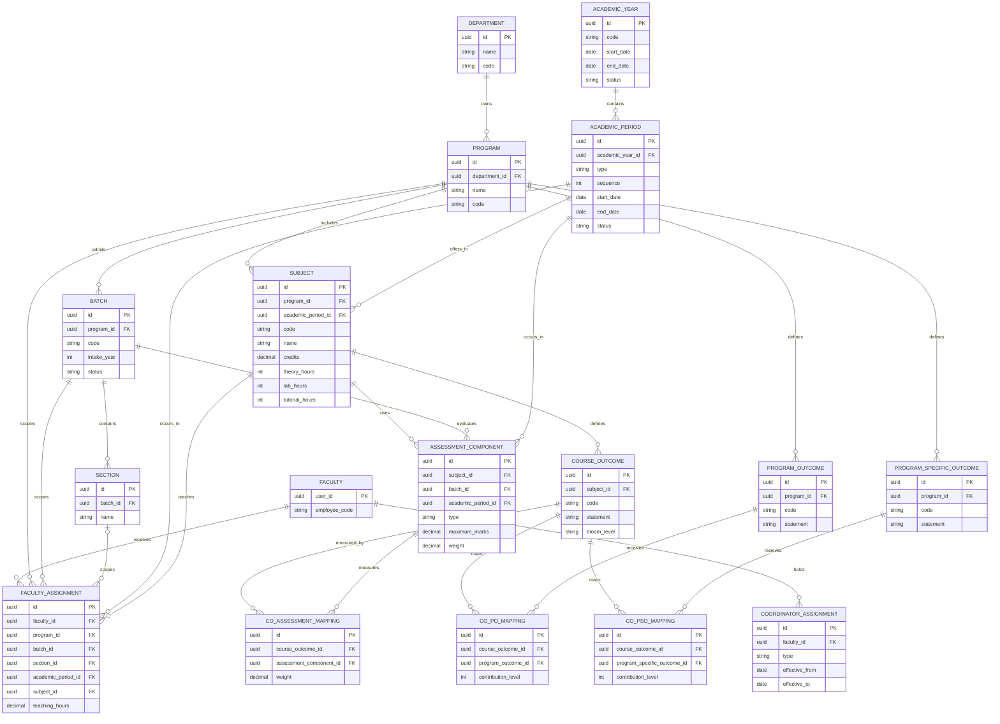
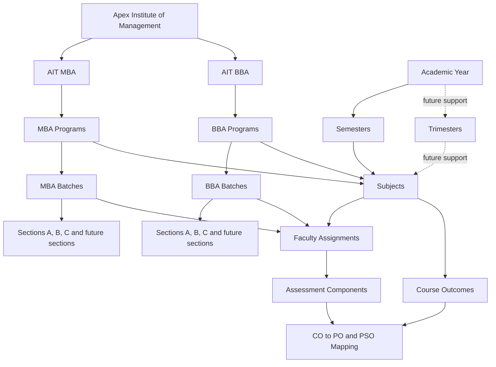

# Apex Institute of Management: Academic Structure

This document defines the academic-domain design for Apex Institute of Management (AIM). It is a documentation-only reference for future implementation and does not introduce backend, frontend, API, model, or migration changes.

## 1. Academic Calendar

The academic calendar provides the time framework for academic delivery, assessment, and reporting. It is organized around an **Academic Year** and the periods that occur within it.

| Concept | Purpose | Core information |
| --- | --- | --- |
| Academic Year | Institutional annual academic window, such as `2025-26`. | Code, start date, end date, status |
| Semester | Standard teaching and assessment period within an academic year. MBA and BBA delivery is initially semester-based. | Academic year, sequence, start date, end date, status |
| Trimester | Future alternative period structure for programs that need three terms in an academic year. | Academic year, sequence, start date, end date, status |

Each calendar period records:

- **Start Date** and **End Date** to define its valid operating window.
- **Status:** `Upcoming`, `Current`, `Completed`, or `Cancelled`.
- A unique code and sequence so periods can be ordered and referenced consistently.

Semester is the current operating model. Trimester support is a future capability and must not require redesigning programs, batches, subjects, or faculty assignments.

## 2. Departments

Academic delivery is organized through two departments:

- **AIT MBA** — owns postgraduate MBA programs, their curriculum delivery, faculty coordination, and academic outcomes.
- **AIT BBA** — owns undergraduate BBA programs, their curriculum delivery, faculty coordination, and academic outcomes.

A department contains one or more programs. The department is the academic home for each program and provides governance, resource allocation, quality oversight, and departmental reporting. A program belongs to exactly one department.

## 3. Programs

A program is a defined academic offering owned by a department. It has its own curriculum, batches, semesters, subjects, faculty assignments, outcomes, and assessment plans.

### MBA programs (AIT MBA)

- Business Analytics
- Data Science & AI
- Strategic HR
- Healthcare & Hospital Management
- AI for Business
- Digital Marketing
- BFSI
- FinTech
- Logistics & Supply Chain

### BBA programs (AIT BBA)

- Business Analytics
- Data Science & AI
- Strategic HR
- Digital Marketing
- FinTech
- Logistics & Supply Chain

## 4. Batches

A batch is a learner cohort admitted to one program for a specified academic intake. A batch provides the operational context for sections, subject delivery, timetables, attendance, assessments, and faculty workload.

Examples:

- `2025 MBA DSAI`
- `2026 MBA BA`
- `2025 BBA FinTech`

Each batch records its code, intake year, program, expected academic duration, and status:

| Batch status | Meaning |
| --- | --- |
| `Upcoming` | Approved or planned, but teaching has not started. |
| `Current` | Actively progressing through its academic periods. |
| `Completed` | Finished its planned academic delivery. |

## 5. Sections

A section divides a batch into manageable teaching groups. Initial section labels are:

- A
- B
- C

A section belongs to one batch. A batch may have one or more sections, and section membership is scoped to the batch's active academic period. The design supports future section labels, additional sections, elective groups, merged sections, and capacity-based allocation without changing the batch or program identity.

## 6. Subjects

A subject is a curriculum unit delivered in one program and one semester. The subject definition records:

| Field | Description |
| --- | --- |
| Subject Code | Unique, human-readable academic identifier. |
| Subject Name | Official title of the subject. |
| Credits | Credit value awarded for successful completion. |
| Theory | Theory-contact hours or component. |
| Lab | Laboratory-contact hours or component. |
| Tutorial | Tutorial-contact hours or component. |
| Semester | The semester in which the subject is offered. |
| Faculty | Faculty assigned to teach it for a batch, section, or period. |
| Program | Program whose curriculum contains the subject. |

The subject catalogue defines the curriculum-level subject. Teaching responsibility is recorded separately through faculty assignments, which permits multiple faculty members to deliver the same subject to different sections or jointly deliver it to one section.

## 7. Faculty Assignment

A faculty assignment connects a faculty member to an actual teaching responsibility. It is the source of academic workload and delivery accountability.

| Field | Description |
| --- | --- |
| Faculty | Faculty member responsible for the teaching assignment. |
| Program | Program in which the teaching occurs. |
| Batch | Cohort receiving the instruction. |
| Semester | Academic period in which the assignment applies. |
| Subject | Subject being delivered. |
| Teaching Hours | Planned contact hours for the assignment, optionally split into theory, lab, and tutorial hours. |
| Coordinator Roles | Active coordinator assignments held by the faculty member, shown as context but not treated as a teaching position. |

An assignment may be scoped further to a section. Coordinator roles remain independent, time-bound faculty assignments and do not replace the faculty member's teaching assignment or reporting line.

## 8. Course Outcome Mapping

Course Outcome (CO) mapping connects subject-level learning outcomes to program-level outcomes and evidence of learning.

| Element | Meaning |
| --- | --- |
| CO | A measurable learning outcome for a subject. |
| PO | A Program Outcome that the course contributes to. |
| PSO | A Program Specific Outcome that the course contributes to. |
| Bloom Level | Cognitive level expected, such as Remember, Understand, Apply, Analyze, Evaluate, or Create. |
| Assessment | Assessment component(s) that provide evidence for achievement of the CO. |

Each subject has one or more COs. A CO may map to multiple POs and PSOs, with an optional contribution strength or weight. CO assessment mapping identifies which assessment components are used to measure each outcome.

## 9. Assessment Structure

An assessment structure defines the components through which a subject is evaluated for a specific batch and semester. The standard supported component types are:

- Quiz
- Assignment
- Presentation
- MST (Mid-Semester Test)
- EST (End-Semester Test)
- Project
- Lab

Each component should record its maximum marks or weight, schedule, evaluation criteria, and whether it contributes to a particular CO. A subject may use only the components appropriate to its curriculum; for example, a theory subject may have no Lab component, while a project-heavy subject may use multiple Project milestones.

## 10. Business Rules

- One subject belongs to one semester within one program curriculum.
- One faculty member can teach multiple subjects, batches, sections, and semesters.
- One subject can have multiple faculty assignments.
- A batch belongs to one program.
- A program belongs to one department.
- A section belongs to one batch and is identified uniquely within that batch.
- Faculty assignments must reference a subject that belongs to the same program and semester as the assignment.
- A batch can be `Upcoming`, `Current`, or `Completed`; its status must reflect the academic calendar state.
- An assessment component belongs to one subject offering for a batch and semester.
- Each CO belongs to one subject; CO-to-PO and CO-to-PSO mappings may be many-to-many.
- Coordinator roles are faculty assignments outside the teaching hierarchy and may coexist with any number of faculty teaching assignments.
- A semester or future trimester must have an end date after its start date and must not overlap an incompatible active period for the same calendar structure.

## 11. Mermaid ER Diagram

## 12. Mermaid Academic Hierarchy

## 13. Future Extensions

- **Timetable:** Generate conflict-aware section, faculty, room, and lab schedules from faculty assignments, teaching hours, and calendar periods.
- **ERP:** Use batches, sections, subject offerings, assessment plans, and outcomes as the academic foundation for fee, examination, inventory, and approval processes.
- **Attendance:** Record attendance by batch, section, subject, faculty assignment, and scheduled session.
- **LMS:** Publish subject materials, assignments, learning activities, and assessment feedback to the correct batch and section.
- **AI Workload:** Use teaching hours, assignment counts, assessment responsibilities, and coordinator assignments to analyze faculty load and suggest balanced allocations.
- **Course Catalog:** Maintain versioned program curricula, subject definitions, credits, prerequisites, and outcome mappings independently from a specific batch's delivery.
