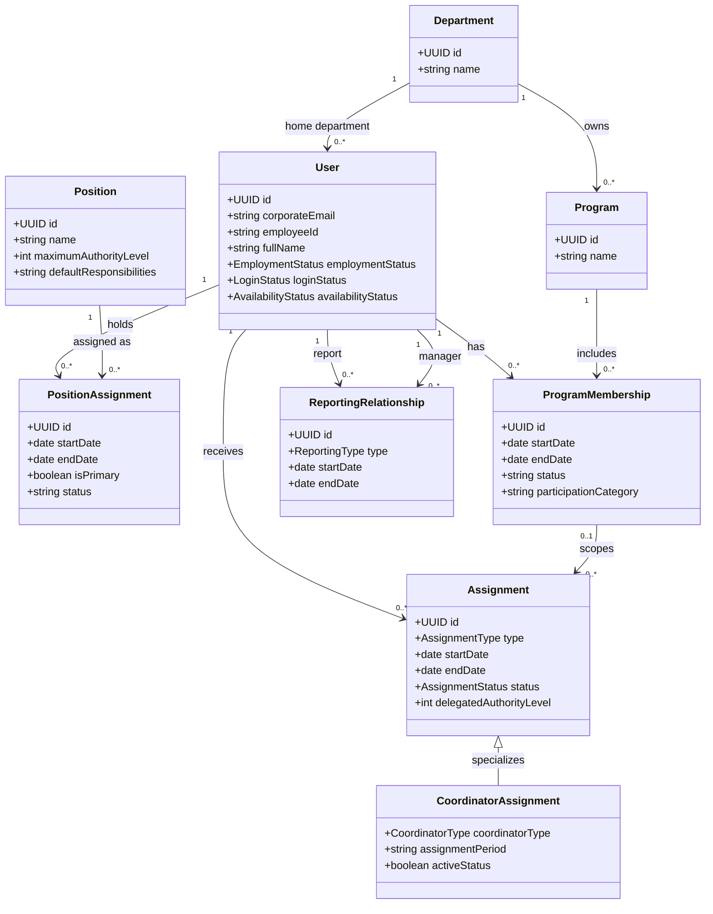
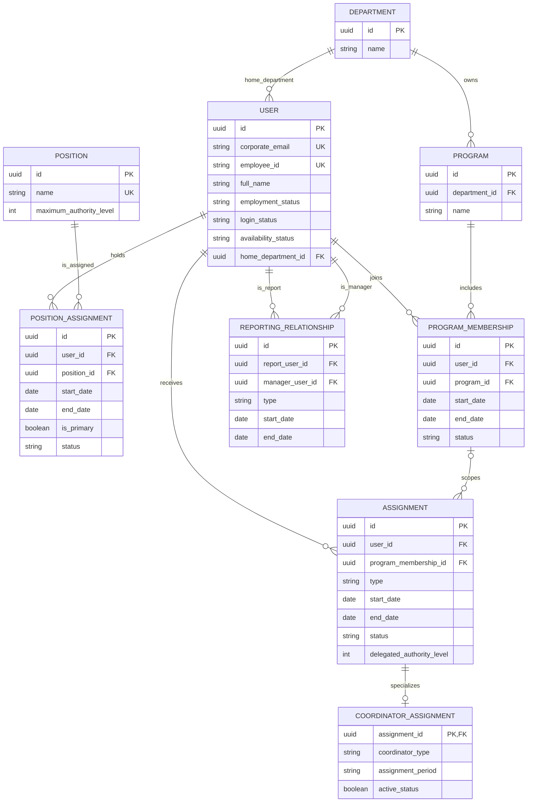

# Apex Institute of Management: User, Position, and Assignment Domain

This document defines how Apex Institute of Management (AIM) represents people as flexible enterprise resources. It is a business-domain design only and does not introduce application, API, database-model, or migration changes.

The central principle is **one person, one user identity**. Responsibilities are represented as assignments against that identity; creating another user record for an additional program, coordinator duty, reviewer responsibility, or approver responsibility is prohibited.

## 1. User

### Purpose

A User represents one person who participates in AIM operations. A user can be an academic leader, faculty member, support staff member, student representative, reviewer, approver, mentor, or any combination of assigned responsibilities. The User is the durable identity to which employment information, permissions, reporting relationships, and assignments attach.

### Unique Identity

Each user has one immutable system identifier and one person record. The identity remains the same when the user changes department, position, program membership, employment status, or assignments. Historical assignments remain attributable to the same person.

### Corporate Email

The corporate email address is the primary login and communication identifier. It must be unique across AIM and normalized consistently for authentication, notifications, task routing, and directory lookup.

### Employee ID

An Employee ID is the human-readable institutional identifier for staff. It must be unique when assigned and must not be reused. A Class Representative may not have an employee ID; their student identity can be linked when student records are introduced.

### Personal Information

User information includes full name, preferred name, contact details, profile image, emergency contact, and other policy-approved directory fields. Sensitive personnel information must be access-controlled and separated from operational assignment data where appropriate.

### Employment Status

Employment status describes the person's institutional relationship, for example `Prospective`, `Active`, `On Leave`, `Separated`, or `Retired`. It controls eligibility for staff assignments but does not erase historical records.

### Login Status

Login status controls access to ApexFlow, for example `Invited`, `Active`, `Suspended`, or `Disabled`. It is independent of employment status: an active employee may be temporarily suspended from login, and a separated employee can retain a disabled historical identity.

### Availability Status

Availability status expresses current operational availability, for example `Available`, `Busy`, `On Leave`, `Unavailable`, or `Do Not Disturb`. It informs task assignment, approval delegation, notifications, and workload planning; it does not change authority or reporting relationships by itself.

## 2. Position

A Position is a defined place in the institute's organizational hierarchy. It sets the default responsibility, primary reporting expectation, management scope, and maximum authority level. A position is not a task, program, or temporary duty.

| Position | Responsibilities | Reports To | Can Manage | Maximum Authority Level |
| --- | --- | --- | --- | --- |
| Executive Director | Institute strategy, policy, institutional approval, and executive oversight. | Governing authority or board, where represented. | Associate Director and institute-wide escalations. | 6 |
| Associate Director | Institute operations, cross-department coordination, and delegated executive delivery. | Executive Director. | HODs and Office Assistants. | 5 |
| HOD | Department leadership, academic quality, resource allocation, and departmental performance. | Associate Director. | Deputy HODs, Program Leaders, Faculty, and Lab Technicians in the department. | 4 |
| Deputy HOD | Delegated departmental supervision and support for the HOD. | HOD. | Program Leaders and Faculty within delegated scope. | 3 |
| Program Leader | Program delivery, program outcomes, faculty coordination, and program-level escalation. | Deputy HOD. | Faculty and Class Representatives assigned to the program. | 2 |
| Faculty | Teaching, assessment, mentoring, academic contribution, and assigned coordination work. | Program Leader. | Class Representatives only when assigned to the relevant class or activity. | 1 |
| Office Assistant | Administrative records, communications, and office-process support. | Associate Director. | Administrative tasks only; no academic staff positions. | 1 (operational) |
| Lab Technician | Laboratory operations, technical inventory, practical-session support, and safety processes. | Relevant HOD. | Technical tasks only; no academic staff positions. | 1 (operational) |
| Class Representative | Class communication, learner feedback, and student coordination. | Assigned Faculty member. | No positions. | 0 |

The authority level is a maximum governance ceiling, not an automatic permission grant. Actual system permissions remain policy-controlled and can be narrowed by department, program, assignment scope, or workflow.

## 3. Assignment

An Assignment is a scoped responsibility granted to a User for a defined purpose and period. It answers **what the person is responsible for now**. A Position answers **where the person sits in the organization**. Keeping them separate lets AIM add or end responsibilities without duplicating the person or changing their primary organizational identity.

For example, one Faculty user can teach subjects in several programs, lead two programs, hold Exam and OBE coordinator assignments, mentor learners, review a task, and approve a workflow. These are separate assignments attached to one user.

Assignment types include:

| Assignment type | Purpose and typical scope |
| --- | --- |
| Program Leader | Leads a named program; aligns with the Program Leader position and may be held alongside faculty teaching assignments. |
| Faculty Assignment | Delivers a subject to a program, batch, section, and academic period. |
| Coordinator Assignment | Owns a named institutional, department, or program coordination responsibility. |
| Reviewer | Reviews a task, submission, document, or workflow step. |
| Approver | Approves or rejects an authorized workflow step. |
| Mentor | Supports a learner, group, faculty member, or assigned cohort. |
| Class Coordinator | Coordinates an identified class or section. |
| Batch Coordinator | Coordinates an identified batch. |
| Admission Coordinator | Coordinates admissions work for an institute, department, program, or intake. |
| Research Guide | Guides assigned research work, learners, or projects. |

Every assignment has an assignment type, assignee, scope, appointing authority, start date, end date when applicable, and active status. A user may hold many concurrent assignments. Assignment records preserve historical accountability after the responsibility ends.

## 4. Coordinator Assignments

Coordinator is an assignment type, not a separate user or permanent organizational position. A faculty member may hold multiple coordinator assignments at the same time, with institute, department, program, batch, or academic-period scope as appropriate.

Supported coordinator assignment types are:

- Exam
- Research
- ERP
- OBE
- MOOC
- Placement
- Admission
- Timetable
- Event
- Website
- Industry
- Social Responsibility
- IQAC
- Admin
- Alumni

Each coordinator assignment records:

| Field | Meaning |
| --- | --- |
| Assignment Period | Named operational period, such as `Semester 1, 2025-26`, or an institute-defined annual period. |
| Start Date | Date on which the assignee becomes responsible. |
| End Date | Date on which the responsibility ends; may be open only for explicitly ongoing assignments. |
| Active Status | Whether the assignment is currently active, inactive, completed, revoked, or superseded. |

Changing a coordinator assignment must not create a new user, alter the user's primary position, or replace the user's primary reporting manager.

## 5. Reporting Manager

Reporting relationships establish accountability while allowing cross-functional assignments.

| Relationship | Definition | Rule |
| --- | --- | --- |
| Primary Reporting Manager | The user's single formal line manager for performance, employment, and normal escalation. | Every active user has exactly one primary reporting manager, except where the Executive Director's external governing authority is recorded as the institutional manager. |
| Secondary Reporting Manager | An optional dotted-line operational contact for a program, project, or temporary assignment. | Does not replace or duplicate the primary manager and has no automatic employment-management authority. |
| Escalation Manager | The person or authority to receive matters that cannot be resolved through the primary manager. | Normally derived from the primary manager's hierarchy; a workflow may designate a scoped alternative when authorized. |

A secondary reporting relationship is a coordination mechanism, not a second primary reporting manager. It permits a person to work across programs while preserving one accountable line manager.

## 6. Program Membership

Program membership captures a user's association with one or more academic programs independently of their home department, primary position, and formal reporting manager.

| Relationship | Cardinality | Meaning |
| --- | --- | --- |
| Department to Program | One department to many programs | A program has exactly one owning department. |
| User to Home Department | One user to one home department | The user's primary organizational home. |
| User to Program Membership | One user to many program memberships | A user may contribute to many programs. |
| Program to User Membership | One program to many user memberships | A program can include many faculty, leaders, coordinators, and support contributors. |
| Program Membership to Assignment | One membership to many scoped assignments | A user's work in a program is expressed through assignments such as teaching, leading, reviewing, mentoring, or coordinating. |

For faculty, program membership allows teaching multiple programs, leading multiple programs, serving as a program reviewer or approver, and contributing to several batches without duplicating the person. Membership can have a start date, end date, status, and a descriptive participation category; it does not itself grant authority.

## 7. Authority Levels

Authority levels provide a consistent governance scale for routing and escalation. They set the highest level at which a position can exercise delegated authority; a particular assignment or workflow may grant less authority.

| Level | Position | Typical authority |
| --- | --- | --- |
| 1 | Faculty | Own academic delivery and assigned operational decisions. |
| 2 | Program Leader | Coordinate and approve authorized program-level work. |
| 3 | Deputy HOD | Supervise delegated departmental operations. |
| 4 | HOD | Govern department-level academic and operational decisions. |
| 5 | Associate Director | Coordinate institute-wide operations and cross-department decisions. |
| 6 | Executive Director | Exercise final institute-level executive authority. |

Office Assistants and Lab Technicians use level-1 operational access for their assigned functions, without academic governance authority. Class Representatives have no staff authority level and only the limited access granted to their representation assignment.

## 8. Business Rules

- One User represents one person and must never be duplicated because of multiple responsibilities.
- Corporate Email must be unique for every user identity.
- Employee ID must be unique when present and must not be reused.
- One user has one primary position at a time in the initial operating model; **many positions per user** is supported as a future extension through effective-dated position assignments.
- One Position can have many users over time and can be the basis for many assignments.
- One user can have many assignments simultaneously.
- One Assignment can apply to many programs when its scope is institute-wide or multi-program; program-specific assignment scope is recorded explicitly.
- One user can have many coordinator assignments concurrently.
- Every active user has one primary reporting manager; secondary reporting is optional and does not create another primary manager.
- A user can belong to many programs while retaining one home department.
- Program Leader assignments, Faculty Assignments, coordinator work, reviewer work, and approver work can coexist on the same user.
- Assignment authority cannot exceed the maximum authority level of the assignee's active position unless an explicit, auditable delegation is approved.
- Expired, revoked, or inactive assignments cannot route new work, approvals, or notifications, but remain in history.

## 9. Mermaid Class Diagram

## 10. Mermaid ER Diagram

## 11. Future Extensions

- **ERP:** Connect the single user identity to HR, payroll, leave, assets, procurement, examination, and finance processes without duplicating people.
- **AI Manager:** Provide an organizationally aware assistant that understands a user's active assignments, authority, availability, program scope, and escalation path.
- **Task Engine:** Route tasks to named assignees, reviewers, and approvers while retaining assignment history and substitute coverage.
- **Workflow:** Use authority level, reporting relationships, and scoped approver assignments to determine approval paths and escalations.
- **Workload Prediction:** Combine teaching hours, program memberships, coordinator work, reviews, approvals, availability, and historical completion data to identify overload and recommend allocation changes.
- **Notifications:** Deliver role- and assignment-aware notifications to the correct active user, respecting availability and delegated coverage.
