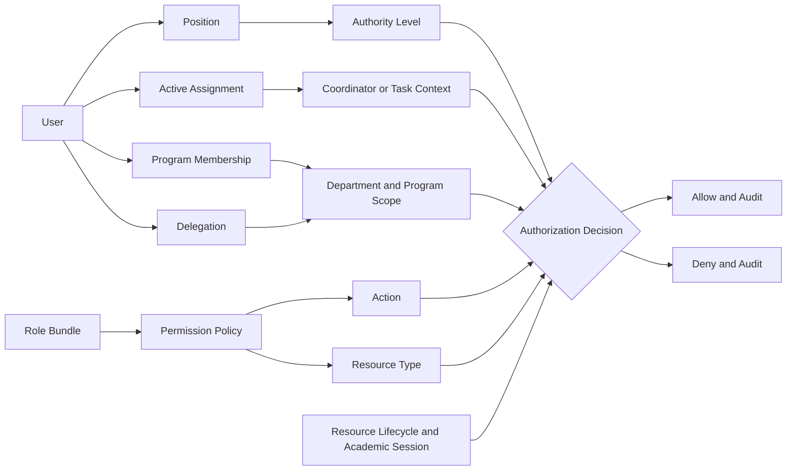
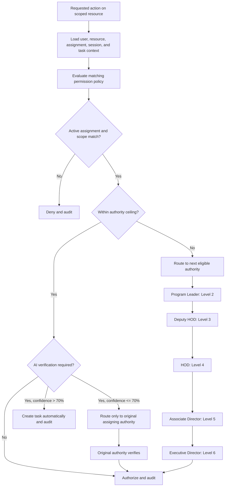

# ApexFlow AI: Permission and Authority Domain

This document defines the enterprise authorization model for ApexFlow AI. It is a documentation-only design and does not introduce backend, frontend, API, model, or migration changes.

The model supports dynamic authority: access is decided from the user's active organizational context, not from a static role name alone.

## 1. Permission Philosophy

Authorization answers one question at request time: **may this user perform this action on this resource in this context?** The answer is calculated from the following concepts.

| Concept | Meaning |
| --- | --- |
| Role | A reusable bundle of capability policies, such as an academic administrator or workflow reviewer. A role is not the final authorization decision. |
| Position | The user's organizational place, such as Faculty or HOD. It supplies maximum authority level and default management scope. |
| Assignment | A time-bound responsibility, such as Program Leader, Exam Coordinator, Reviewer, or Approver. It can supply authority for its defined scope. |
| Authority Context | The current facts used to evaluate a request: active position and assignments, organization, department, program, batch, academic session, ownership, reporting line, delegation, and task authority. |
| Permission | A policy statement that allows or denies an action on a resource type within a scope. |
| Resource | The target business object, such as a program, task, report, or document, including its organizational ownership and lifecycle state. |
| Action | The requested operation, such as View, Update, Approve, or Delegate. |

Roles keep policy administration maintainable; positions and assignments make policy applicable to real work. For example, a user with a Faculty position may view assigned subjects, while the same user can approve an examination task only when holding an active, scoped Exam Coordinator or Approver assignment with adequate delegated authority.

## 2. Permission Categories

Permission codes are grouped by category for governance and discovery. Each code follows the pattern `<category>.<resource>.<action>` and is evaluated with a context scope.

| Category | Covers |
| --- | --- |
| System Administration | Tenant configuration, permission policy, integration settings, audit access, and operational administration. |
| Academic Administration | Academic sessions, curriculum, batches, sections, subjects, outcomes, assessments, and teaching allocations. |
| Task Management | Task creation, assignment, review, completion, reassignment, and escalation. |
| Workflow | Workflow definitions, routing, approvals, rejections, delegations, and exception handling. |
| Reports | Report generation, viewing, export, scheduling, and distribution. |
| AI | AI assistant use, AI-generated work, confidence verification, model configuration, and AI audit records. |
| Email | Connected-mailbox access, sending, drafting, routing, and email-derived task handling. |
| Organization | Departments, programs, users, positions, assignments, reporting lines, and coordinator assignments. |
| Knowledge Base | Documents, articles, policies, templates, indexing, publishing, archiving, and restoration. |

## 3. Resource Types

The authorization layer recognizes the following resource types and their organizational scope.

| Resource type | Primary scope |
| --- | --- |
| Department | Organization and department. |
| Program | Organization and owning department. |
| Batch | Program, department, and academic session. |
| Subject | Program, department, and academic session or semester. |
| Task | Creator, assignee, original assigning authority, workflow, and related organizational resource. |
| Workflow | Organization, department, program, and workflow definition. |
| Email | Owning mailbox, sender/recipient relationship, and linked task or workflow context. |
| Document | Organization, department, program, classification, and knowledge-base lifecycle state. |
| Report | Report owner, audience scope, source resources, and sensitivity classification. |
| User | Home department, position, reporting relationship, and active assignments. |
| Coordinator Assignment | Assignee, assignment type, effective period, and institute, department, program, batch, or session scope. |

## 4. Actions

The standard action vocabulary is shared across categories. A resource policy may expose only a subset of these actions.

| Action | Meaning |
| --- | --- |
| View | Read a resource within the permitted scope. |
| Create | Create a new resource or draft within the permitted scope. |
| Update | Change an existing resource within the permitted scope. |
| Delete | Permanently remove a resource where policy and retention rules allow it. |
| Assign | Allocate a resource, task, responsibility, or participant. |
| Approve | Authorize a workflow step or controlled change. |
| Reject | Decline a workflow step or controlled change with a recorded reason. |
| Review | Examine work and provide a review outcome without necessarily granting final approval. |
| Escalate | Route unresolved work to the appropriate higher authority. |
| Archive | Remove an inactive resource from normal use while retaining it. |
| Restore | Return an archived resource to an active lifecycle state. |
| Delegate | Grant a time-bound, auditable portion of the actor's authority to another eligible user. |

## 5. Dynamic Authority Context

Effective access is calculated for each request from the permission policy plus the resource and the user's current context. A permission is not globally granted merely because a user has a title.

| Context input | Authorization effect |
| --- | --- |
| Current Assignment | Only active, effective-dated assignments can provide responsibility-specific access. An expired Exam Coordinator assignment cannot approve exam work. |
| Program | Program membership and program-scoped assignments allow access only to named programs, their batches, subjects, tasks, and reports. |
| Department | Home department, managerial position, and department-scoped assignments constrain access to the relevant department and its programs. |
| Coordinator Role | A coordinator assignment supplies only the permissions required for its stated type and scope; it does not grant general departmental administration. |
| Academic Session | Academic resources and assignments are valid only in their active academic-session or period scope, unless a historical-view policy applies. |
| Task Authority | The task's creator, assignee, reviewer, approver, original assigning authority, workflow state, and delegation record determine who may act on it. |

The evaluation sequence is:

1. Authenticate the user and confirm their login status is active.
2. Load the target resource and derive its organizational, academic, ownership, and lifecycle context.
3. Load active positions, assignments, program memberships, reporting lines, and delegations effective at the request time.
4. Find matching permission policies from direct grants and role bundles.
5. Intersect every allow with the user's authority level and the resource scope; apply explicit denies and lifecycle restrictions.
6. Record an auditable authorization decision, including the policy, context facts, and delegation if used.

## 6. Authority Levels

| Level | Position | Normal scope |
| --- | --- | --- |
| 1 | Faculty | Assigned subjects, batches, programs, learners, and delegated operational work. |
| 2 | Program Leader | Assigned program and its academic delivery, people, and program workflow. |
| 3 | Deputy HOD | Delegated departmental scope and the programs within it. |
| 4 | HOD | Full department scope and its programs. |
| 5 | Associate Director | Cross-department and institute-wide delegated operations. |
| 6 | Executive Director | Final institute-level executive authority. |

### Escalation

Escalation follows the active primary reporting hierarchy and preserves the resource's scope:

```text
Faculty (1) -> Program Leader (2) -> Deputy HOD (3) -> HOD (4)
            -> Associate Director (5) -> Executive Director (6)
```

An escalation moves a specific decision or task; it does not grant the recipient unrestricted access. If a level is absent, unavailable, conflicted, or lacks the required scoped policy, the system routes to the next eligible authority and records the reason. An explicit workflow route can override the default chain only when its policy is approved and auditable.

## 7. Verification Rules

AI-generated work is governed by a confidence threshold and a strict verification route.

| AI confidence | Handling |
| --- | --- |
| Greater than 70% | The system may create a task automatically, subject to normal task policy and audit logging. Creation does not automatically approve or complete the work. |
| Less than or equal to 70% | The system must request verification. Verification is routed **only to the original assigning authority**. It must not be rerouted automatically to the assignee, reviewer, manager, coordinator, delegate, or escalation authority. |

The original assigning authority is stored immutably on the task or AI request at the time of assignment. If that authority is no longer eligible to act, the verification remains pending and is handled through an explicit policy exception; it is never silently reassigned by an authority-level rule.

Examples for an AI-confidence value of 70% or lower:

| Original assigning authority | Verification recipient |
| --- | --- |
| Faculty assigned a task | That same Faculty user. |
| Program Leader assigned a task | That same Program Leader user. |
| HOD assigned a task | That same HOD user. |
| Associate Director assigned a task | That same Associate Director user. |
| Executive Director assigned a task | That same Executive Director user. |

## 8. Delegation Rules

Delegation is a scoped, time-bound, revocable authority record. It never changes a user's position, reporting manager, or maximum authority level, and it cannot grant more authority than the delegator holds in the stated context.

| Delegation type | Purpose | Required controls |
| --- | --- | --- |
| Temporary Delegation | Cover a defined short-term responsibility or workflow. | Start/end dates, resource scope, actions, delegate eligibility, delegator approval, and audit trail. |
| Permanent Delegation | Provide continuing authority until revoked or superseded. | Explicit policy approval, periodic review, revocation path, scope and action limits, and audit trail. |
| Vacation Delegation | Cover planned absence. | Absence period, return date, narrowly defined tasks/workflows, and automatic expiry. |
| Emergency Delegation | Maintain continuity during an unexpected absence or incident. | Reason, emergency authorizer, immediate audit event, short expiry, and mandatory post-event review. |

Delegations are evaluated after the original actor's policy but before normal escalation. The delegate receives only the stated actions and scopes. Delegations cannot bypass an explicit deny, retention control, separation of duties, or the verification rule that routes low-confidence AI verification only to the original assigning authority.

## 9. Business Rules

- **Dynamic permissions:** Effective permissions are calculated at request time from policy, position, assignment, scope, lifecycle, and delegation facts.
- **Context-aware authorization:** An allow must match the resource's organization, department, program, batch, academic session, task, or workflow context; a title alone is insufficient.
- **No duplicated permissions:** A permission is defined once as a policy code and may be referenced by roles or assignments. The system calculates an effective set rather than copying permission records to users for each responsibility.
- **Inheritance rules:** Organization scope can be narrowed to department, program, batch, and subject. A child scope cannot broaden an inherited allow. Resource ownership and lifecycle restrictions still apply.
- **Conflict resolution:** Explicit deny overrides allow; the narrowest applicable scope overrides a broader scope; active, more-specific assignment context overrides a general role allow; and the lowest necessary authority is preferred. Conflicts that remain unresolved are denied and audited.
- **Authority ceiling:** No direct grant, role, assignment, or delegation may exceed the user's active position authority ceiling without an explicit, auditable executive exception.
- **Temporal validity:** Expired, inactive, revoked, or future-dated assignments and delegations do not grant access.
- **Separation of duties:** A policy may prohibit one user from creating, reviewing, and approving the same controlled resource unless an approved exception exists.
- **Auditability:** Every approve, reject, delegate, escalate, restore, delete, and AI-verification action records actor, authority basis, resource, scope, time, and outcome.

## 10. Mermaid Permission Graph



## 11. Mermaid Authority Flow



## 12. Future Extensions

- **Attribute Based Access Control:** Express policies using verified user, resource, environment, and relationship attributes while retaining the authority model in this document.
- **Policy Engine:** Centralize policy evaluation, versioning, simulation, test cases, and decision explanations.
- **Rule Engine:** Configure institution-specific routing, retention, separation-of-duties, escalation, and delegation rules without application-code changes.
- **External Identity Provider:** Federate authentication and identity lifecycle with an enterprise identity provider while preserving ApexFlow's contextual positions, assignments, and authority decisions.
