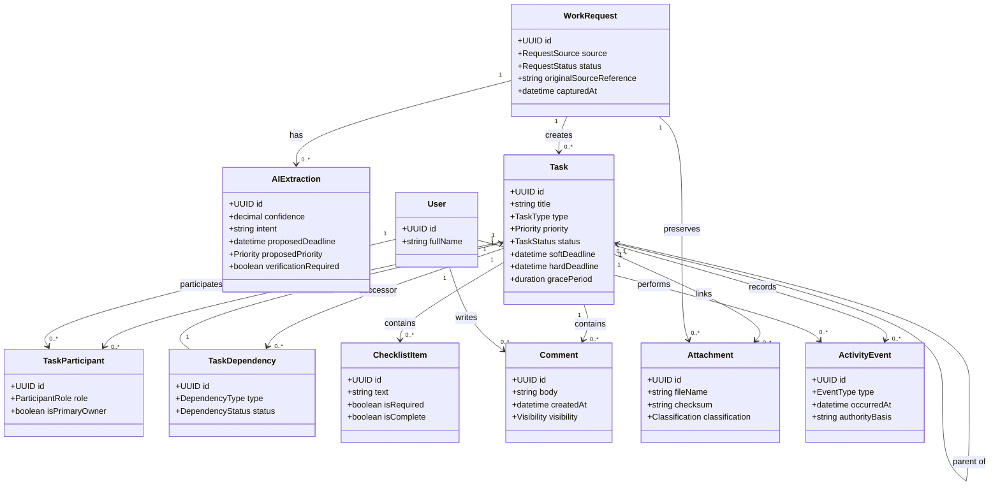
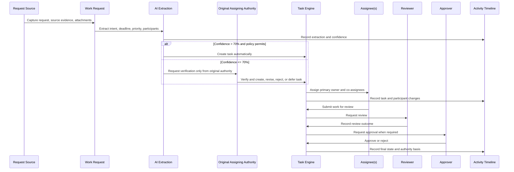
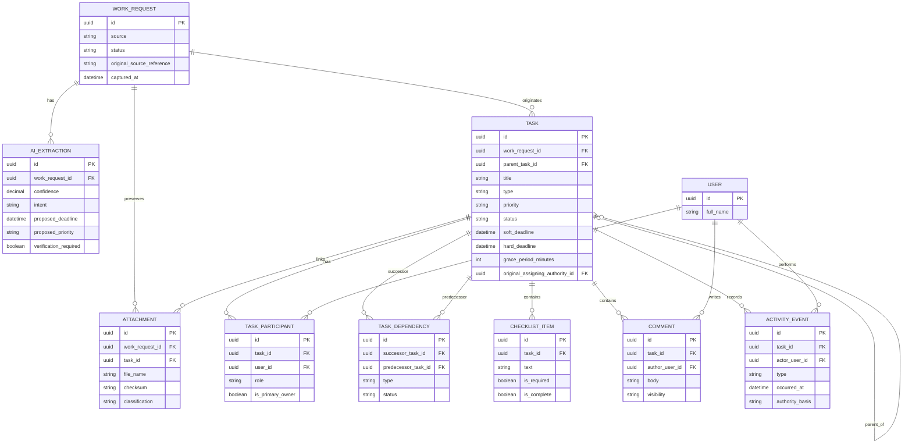

# ApexFlow AI: Work Request and Task Domain

This document defines the complete work lifecycle for ApexFlow AI, from an incoming request through extraction, planning, execution, review, approval, closure, and audit. It is a documentation-only design and does not introduce application-code, API, model, or migration changes.

## 1. Work Request

A Work Request is the immutable intake record for a unit of requested work. It preserves what was received, where it originated, and the evidence attached to it before the request is converted into one or more tasks. A request may result in no task, one task, or a task hierarchy.

### Sources

| Source | Intake use |
| --- | --- |
| Email | Captures an inbound or sent email and its metadata as the original request evidence. |
| Manual | A user creates a request directly in ApexFlow. |
| Meeting | Captures an agreed action from meeting notes or minutes. |
| Calendar | Derives work from a scheduled event, reminder, or milestone. |
| AI Suggestion | Records work proposed by an AI assistant before human confirmation or permitted automatic creation. |
| Import | Brings work in from an approved external file, system, or migration process. |

### Request Status

| Status | Meaning |
| --- | --- |
| `Received` | Captured but not yet assessed. |
| `Extracting` | AI or a user is deriving structured work details. |
| `Verification Required` | Extraction requires confirmation before task creation or routing. |
| `Accepted` | Confirmed as valid work to be planned. |
| `Converted` | One or more tasks have been created and linked. |
| `Rejected` | Not accepted as a work item; reason is recorded. |
| `Duplicate` | Linked to the canonical request or task. |
| `Archived` | Retained for history but excluded from active intake. |

### Original Source

The Work Request stores immutable source information: source type, source-system identifier, captured timestamp, source author or sender where available, original subject/title, raw body or reference, and the user or integration that captured it. Original source evidence is never overwritten by AI extraction or task editing.

### Attachments

Request attachments are immutable evidence files or links received with the request. They carry filename, media type, size, checksum, source reference, uploader, classification, and retention status. A later task may reference the same attachment without duplicating the file.

## 2. AI Extraction

AI Extraction transforms unstructured request content into a proposed structured work plan. Extraction is advisory until it satisfies the confidence and verification policy.

| Extracted item | Purpose |
| --- | --- |
| Confidence | Numeric confidence score for the overall extraction and optionally for individual fields. |
| Intent | Proposed action or work objective, such as prepare, review, schedule, resolve, or approve. |
| Deadline | Proposed due date, due time, and whether it is soft or hard. |
| Priority | Proposed Critical, High, Medium, or Low urgency. |
| Assignees | Proposed accountable assignee and optional co-assignees. |
| Reviewer | Proposed person or assignment responsible for review. |
| Approver | Proposed person or assignment responsible for final approval. |
| Verification Required | Boolean and reason explaining whether a human must verify extraction before use. |

When confidence is greater than 70%, the system may create a task automatically if normal authorization permits. When confidence is less than or equal to 70%, verification is required and routes only to the original assigning authority recorded on the work request or resulting task. The original source, raw extraction result, model/version reference, confidence, and verification decision are retained for audit.

## 3. Task

A Task is the actionable, assignable unit of work created from a Work Request or directly in the task engine. It has a title, description, type, priority, status, authority context, dates, participants, relationships, and full history.

### Task structure and participants

| Element | Design |
| --- | --- |
| Parent Task | An optional task that groups or governs child tasks. Parent completion rules can require child completion. |
| Child Task | A task within a parent hierarchy; it retains its own assignees, priority, status, and audit history. |
| Dependencies | Explicit relationships that control whether a task can start, progress, or complete. |
| Multiple Assignees | More than one accountable participant is supported when the task requires shared delivery. One assignee may be designated as the primary owner. |
| Co-Assignees | Additional delivery participants with the same or explicitly reduced task responsibilities. |
| Watchers | Interested users who receive updates but have no delivery, review, or approval authority by default. |
| Reviewer | A user or eligible assignment that evaluates submitted work. Review does not imply final approval. |
| Approver | A user or eligible assignment that approves or rejects controlled completion. |
| Escalation Authority | The next eligible authority for unresolved, overdue, blocked, or exception work; derived from the authority model unless a workflow provides an approved scoped route. |

### Task lifecycle

`Draft` -> `Open` -> `In Progress` -> `Submitted for Review` -> `Reviewed` -> `Pending Approval` -> `Completed`

At any appropriate point, a task may become `Blocked`, `On Hold`, `Cancelled`, `Rejected`, `Overdue`, or `Archived`. Reopening creates a recorded transition and preserves the prior completion decision.

## 4. Task Types

Task types classify work for routing, reporting, templates, service targets, and default policies. They are configurable; the following types are initial values:

| Task type | Typical work |
| --- | --- |
| Academic | Curriculum, teaching, learning, assessment, and academic operations. |
| Administrative | Institute administration, records, communications, and operational support. |
| Research | Research activity, proposal, publication, review, or guide responsibilities. |
| Examination | Examination planning, question papers, evaluation, moderation, and results work. |
| Event | Event planning, coordination, execution, and follow-up. |
| Admission | Admission inquiry, application, verification, counseling, and intake work. |
| Placement | Employer engagement, student readiness, placement drive, and outcome tracking. |
| Finance | Budget, expense, invoice, approval, or financial-control work. |
| Infrastructure | Facility, equipment, laboratory, IT, maintenance, or procurement-related work. |
| Student | Student support, mentoring, grievance, representation, or engagement work. |
| Compliance | IQAC, OBE, audit, policy, accreditation, or regulatory work. |
| Custom | Institution-configured type with its own template and policy. |

## 5. Task Priority

Priority expresses business urgency and drives ordering, notifications, escalation timing, and reporting. It does not override authorization or a hard deadline.

| Priority | Meaning |
| --- | --- |
| Critical | Immediate institutional, safety, compliance, or time-sensitive impact; requires immediate notification and expedited escalation policy. |
| High | Important work needing prompt attention before normal planning windows close. |
| Medium | Standard planned work with normal service expectations. |
| Low | Useful but non-urgent work that can be scheduled around higher-priority commitments. |

## 6. Deadlines

Tasks can record multiple deadline controls to distinguish planning from mandatory completion.

| Deadline control | Meaning |
| --- | --- |
| Soft Deadline | Target date used for planning, reminders, and early-risk reporting. Passing it does not by itself breach policy. |
| Hard Deadline | Mandatory completion boundary. Passing it marks the task overdue and may trigger escalation. |
| Grace Period | Explicit period after a hard deadline during which the work remains overdue but follows a defined remediation path before further escalation or closure controls. |

Deadline changes require an auditable reason, authority check, and notification to affected assignees, reviewers, approvers, and watchers. A dependency block does not silently change a hard deadline; it creates a visible risk or escalation event.

## 7. Task Relationships

Task relationships make planning and execution explicit.

| Relationship | Meaning |
| --- | --- |
| Parallel Tasks | Independent tasks that can proceed concurrently, often under a common parent or milestone. |
| Dependent Tasks | A successor task waits for a predecessor condition such as finish-to-start, finish-to-finish, start-to-start, or start-to-finish. |
| Blocked Tasks | A task is prevented from progressing by an unresolved dependency, external condition, decision, resource, or access issue. |
| Milestones | Zero-duration or date-focused checkpoints used to track a significant outcome or decision. |
| Checklist | Ordered or unordered small completion items within a task; a checklist item is not a full task unless promoted. |

Dependencies must not form a cycle. A blocked task remains visible to assignees and watchers and exposes its blocker, owner, and escalation path.

## 8. Comments

Comments provide structured discussion on a work request or task. Each comment records author, timestamp, body, mentions, visibility, edit history, and optional reply relationship. Mentions notify eligible users only; they do not add an assignee, watcher, reviewer, or approver role automatically. Restricted comments may be visible only to authorized workflow participants or organizational scopes.

## 9. Attachments

Task attachments hold work products, evidence, reference material, or linked files. Each attachment records its source request or task, version, uploader, timestamp, checksum, media type, classification, and retention state. Attachments can be linked across parent/child tasks and comments without copying their content. Access to an attachment is the intersection of attachment classification and the viewer's authority on the linked request or task.

## 10. Activity Timeline

The Activity Timeline is an append-only account of significant lifecycle events. It includes creation, AI extraction, verification, status changes, assignments, co-assignment changes, watcher changes, comments, attachment links, priority changes, deadline changes, dependency changes, review, approval, rejection, escalation, delegation, and archival or restoration.

Each event records the actor or system, timestamp, before/after values where relevant, authority basis, source reference, and correlation identifier. Timeline events cannot be edited; corrections are new events that refer to the original entry.

## 11. Business Rules

- Every task has exactly one originating Work Request or an explicit direct-creation source record.
- A Work Request may create zero, one, or many tasks; the relationship is retained permanently.
- Original source content and attachments are immutable evidence; extracted or edited task fields do not replace them.
- AI extraction at confidence greater than 70% may create a task automatically only when authorization permits; task completion and approval remain human-controlled unless separately authorized.
- AI extraction at confidence less than or equal to 70% requires verification only by the original assigning authority; it is not automatically rerouted to a manager, reviewer, approver, delegate, or escalation authority.
- A task may have multiple assignees, but each must have an explicit participant record and one primary owner may be designated.
- Reviewer and Approver must be eligible through active, scoped authority. A policy can require them to be different people from the creator or primary assignee.
- Watchers receive visibility and notifications only; they cannot update, review, approve, or reassign work unless separately authorized.
- Parent/child relationships and dependencies must remain acyclic.
- A task cannot be completed while a mandatory checklist item or mandatory child task remains incomplete, unless an authorized exception is recorded.
- Hard-deadline breaches and blocked tasks produce timeline events and follow the applicable escalation policy.
- Deleted work is retained according to policy or represented as archived; permanent deletion requires explicit retention authority and audit evidence.
- All status, assignment, review, approval, deadline, and priority changes are recorded in the Activity Timeline.

## 12. Mermaid Class Diagram

## 13. Mermaid Sequence Diagram

## 14. Mermaid ER Diagram

## 15. Future Extensions

- **Workflow Templates:** Apply task-type-specific status paths, reviewer/approver requirements, service targets, and escalation policies.
- **Calendar and Email Integration:** Create and synchronize work requests from mail, meetings, calendar events, and reminders with source traceability.
- **AI Planning:** Propose task hierarchies, dependencies, checklists, workloads, and due-date risks while retaining verification and authority controls.
- **Capacity and Workload Forecasting:** Use active assignments, teaching hours, task estimates, deadlines, and availability to recommend equitable allocation.
- **SLA and Compliance Controls:** Add configurable service-level targets, retention rules, evidence requirements, legal holds, and compliance dashboards.
- **External Collaboration:** Support controlled guest participants, external approvers, and secure document exchange without exposing internal organizational data.
