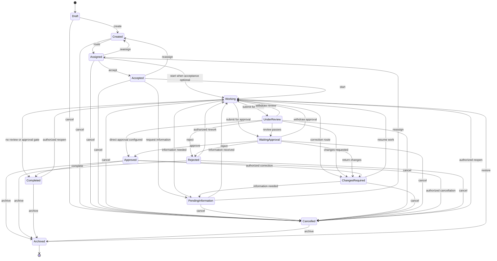
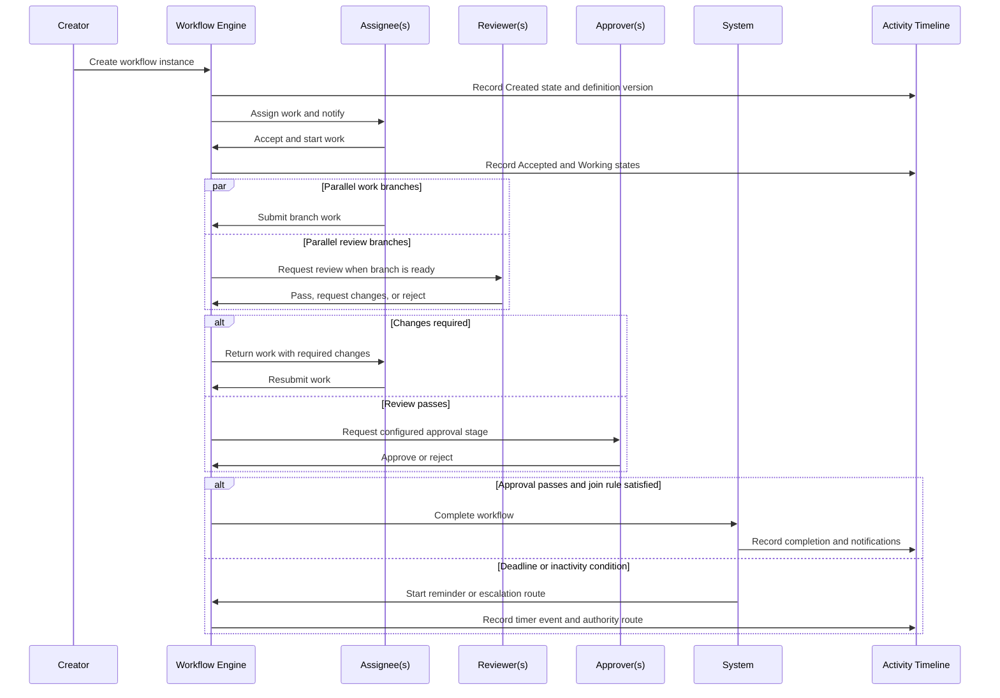
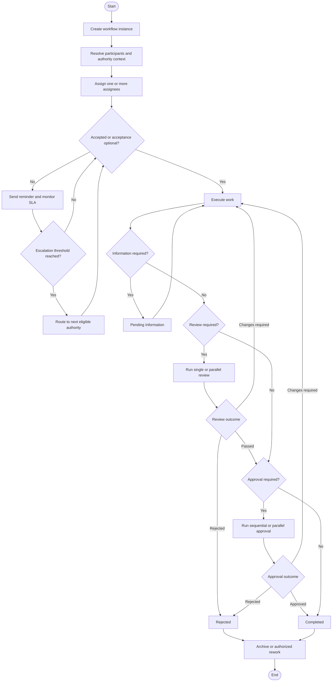

# ApexFlow AI: Workflow Domain

This document defines a configurable enterprise workflow engine for ApexFlow AI. It is a documentation-only design and does not introduce backend, frontend, database, API, or migration changes.

## 1. Workflow Overview

The workflow engine controls how a work item moves through accountable states. A workflow definition is configuration: it specifies allowed states, transitions, actor requirements, authority rules, conditions, service targets, notifications, and audit requirements. A workflow instance is the runtime execution of that definition for a task, request, approval, or other supported resource.

The engine supports:

- **Human workflows:** people create, accept, work, review, approve, and complete work.
- **AI-assisted workflows:** AI proposes extraction, routing, or actions while confidence, verification, and authority policies retain human accountability.
- **Approval workflows:** one or more authorized approvers make recorded decisions.
- **Parallel workflows:** multiple assignees, reviewers, or approvers progress concurrently under a defined completion rule.
- **Conditional workflows:** state routes are selected from evaluated facts such as deadline status, review outcome, confidence, authority, or resource type.
- **Multi-stage workflows:** a configured sequence of assignments, reviews, approvals, and completion gates.

Workflow configuration must be versioned. An active instance keeps its originating definition version so later configuration changes do not rewrite its history.

## 2. Workflow States

| State | Meaning |
| --- | --- |
| Draft | Work is being prepared and is not yet active or routed. |
| Created | The workflow instance exists and is ready for assignment or automated routing. |
| Assigned | An accountable assignee or assignment group has been selected. |
| Accepted | The primary assignee has accepted responsibility. |
| Working | Active execution is in progress. |
| Pending Information | Work cannot continue until required information, evidence, or a decision is received. |
| Waiting Approval | Work is complete enough for an approval decision and awaits approver action. |
| Under Review | Work is submitted to one or more reviewers. |
| Changes Required | Reviewer or approver has returned work with required changes. |
| Approved | Required approval gate(s) have passed. |
| Rejected | Reviewer or approver has rejected the work or a required decision. |
| Completed | All required execution, review, approval, and completion conditions have passed. |
| Archived | Closed work is retained for history and removed from active queues. |
| Cancelled | Work has been stopped by an authorized actor before normal completion. |

## 3. State Transitions

The following table defines every valid standard transition. A workflow template can disable transitions, add approved conditional transitions, or require additional gates, but it cannot bypass authorization, audit, or terminal-state rules.

| From | Valid transition(s) | Trigger and rule |
| --- | --- | --- |
| Draft | Created, Cancelled | Creator or authorized delegate creates the instance; creator or authorized authority may cancel. |
| Created | Assigned, Cancelled | Authorized routing assigns an eligible actor; authorized authority may cancel. |
| Assigned | Accepted, Working, Created, Cancelled | Assignee accepts or starts where acceptance is optional; authorized router can return for reassignment; authority may cancel. |
| Accepted | Working, Pending Information, Created, Cancelled | Assignee starts work, requests information, returns for reassignment, or authorized authority cancels. |
| Working | Pending Information, Under Review, Waiting Approval, Completed, Changes Required, Cancelled | Assignee requests information, submits for review/approval, completes if no gate applies, responds to a return-for-change route, or authorized authority cancels. |
| Pending Information | Working, Assigned, Cancelled | Authorized provider supplies information; authorized router reassigns; authority may cancel. |
| Under Review | Changes Required, Waiting Approval, Approved, Rejected, Working, Cancelled | Reviewer returns changes, passes work to approval, records direct approval when configured, rejects, releases to working when review is withdrawn, or authority cancels. |
| Changes Required | Working, Pending Information, Cancelled | Assignee resumes correction, requests information, or authority cancels. |
| Waiting Approval | Approved, Changes Required, Rejected, Working, Cancelled | Required approver(s) decide; approval may be withdrawn to working only before terminal completion; authority may cancel. |
| Approved | Completed, Archived, Changes Required, Cancelled | System or authorized actor completes; approved record may be archived; authorized correction/reopen or cancellation requires audit. |
| Rejected | Working, Archived, Cancelled | Authorized rework reopens the item, or the rejected item is archived/cancelled. |
| Completed | Archived, Working | Retention process archives; authorized reopening returns to working with a recorded reason. |
| Archived | Working | Authorized restore reopens to working; no other standard transition is permitted. |
| Cancelled | Working, Archived | Authorized restore/reopen returns to working; retention process archives. |

`Completed`, `Archived`, and `Cancelled` are terminal for ordinary participants. A reopening transition requires an authorized actor, reason, notification, and immutable audit event.

## 4. Actors

| Actor | Workflow responsibility |
| --- | --- |
| Creator | Creates the work item and may supply initial context, participants, and workflow selection. |
| Assignee | Primary accountable delivery participant; accepts and executes assigned work. |
| Co-Assignee | Additional delivery participant with explicitly configured responsibility. |
| Reviewer | Evaluates submitted work and may pass, request changes, or reject within scope. |
| Approver | Makes required approval or rejection decisions within authority and scope. |
| Watcher | Receives configured visibility and notifications without transition authority by default. |
| AI Manager | Authorized AI service or supervising user that proposes extraction, routing, summaries, and permitted automated actions. |
| System | Executes configured timers, conditions, notifications, service-level events, and audit records. |

Actor eligibility is evaluated from permission policy, active position, assignment, authority level, organizational scope, academic session, task authority, and any valid delegation.

## 5. Transition Rules

Every transition evaluates the following controls before it takes effect.

| Control | Rule |
| --- | --- |
| Who can move | The workflow transition specifies eligible actor types; the actor must be the named participant or hold a matching active, scoped assignment or authorized delegation. |
| Required permissions | The actor must have the resource-specific transition permission, such as `workflow.task.review`, `workflow.task.approve`, or `workflow.task.escalate`, evaluated in context. |
| Conditions | The transition can require fields, attachments, checklist completion, dependency status, review outcomes, approval thresholds, AI confidence, or an authority level. |
| Notifications | The engine notifies affected participants using the configured channel matrix. Required notifications cannot be suppressed by a watcher preference. |
| Audit logging | Every attempted and completed transition records the actor/system, source and target state, time, authority basis, condition result, definition version, and reason or comment when required. |

The system denies a transition when authorization, scope, condition, separation-of-duties, or lifecycle checks fail. Denials are auditable but do not alter workflow state.

## 6. Parallel Workflow

Parallel stages allow independent work to proceed simultaneously while retaining a configured join rule.

| Parallel participant | Supported behavior |
| --- | --- |
| Multiple assignees | Each assignee receives a participant instance. The join rule can require all assignees, any assignee, a minimum count, or primary-owner completion plus required co-assignee confirmation. |
| Multiple reviewers | Reviews may run in parallel. The definition specifies whether all, any, a minimum count, or a lead reviewer outcome is required. A rejection or changes-required result can short-circuit the stage if configured. |
| Multiple approvers | Approvals may run in parallel. The definition specifies all required, any one, quorum, weighted approval, or authority-tier rules. |

Each parallel branch has its own status, evidence, participant, deadline, and timeline events. The parent workflow does not leave the parallel stage until its configured join rule is satisfied or a configured failure route is selected.

## 7. Conditional Workflow

Conditional routes use evaluated facts rather than a fixed next state.

| Condition | Default route |
| --- | --- |
| Deadline missed | System marks risk or overdue status in the instance context, sends reminder/warning, and starts the configured escalation timer. |
| Reviewer rejects | Route to `Rejected` or `Changes Required` according to the review decision and template policy. |
| AI confidence low | Require verification by the original assigning authority before task creation, assignment, or automated transition. Confidence less than or equal to 70% cannot be silently routed to another authority. |
| Manager escalation | Route the decision or task to the next eligible authority in the reporting hierarchy while preserving resource scope and audit evidence. |

Additional conditions can reference task type, priority, department, program, batch, academic session, attachment classification, checklist completion, dependency state, or configured business rules.

## 8. Escalation Workflow

Escalation protects delivery without granting unbounded access. It moves only the affected item and only to an eligible authority in the relevant scope.

| Stage | Trigger | Result |
| --- | --- | --- |
| Reminder | Approaching soft or hard deadline, or a configured inactivity period. | Notify assignee, co-assignees, and optionally watcher/creator. |
| Warning | Soft deadline missed, hard deadline approaching, or repeated inactivity. | Notify assignee and primary reporting manager; record an at-risk event. |
| Escalation | Hard deadline missed, grace period expired, blocker unresolved, or authority exception. | Route to the next eligible authority; retain the original assignee and task context. |
| Emergency Escalation | Critical priority, safety, compliance, outage, or configured emergency trigger. | Immediately notify and route to the emergency authority path, with high-priority audit and acknowledgement requirements. |

Default authority progression is Faculty -> Program Leader -> Deputy HOD -> HOD -> Associate Director -> Executive Director. If an authority is unavailable, conflicted, out of scope, or lacks the policy, the engine selects the next eligible authority and records the skipped level and reason.

## 9. Approval Workflow

Approval stages are explicit gates with named or dynamically resolved eligible approvers.

| Approval mode | Completion rule |
| --- | --- |
| Single approval | One eligible approver approves or rejects. |
| Multiple approval | The definition identifies several required approvers and their required decision policy. |
| Sequential approval | Approvers act in configured order; later stages cannot act until earlier required stages pass. |
| Parallel approval | Eligible approvers act concurrently; completion follows the configured all, any, quorum, weighted, or tiered rule. |

An approval decision records the approver, authority context, decision, timestamp, comment, evidence, delegation if used, and workflow-definition version. A rejection or changes-required outcome follows the configured conditional route and does not erase prior decisions.

## 10. SLA Rules

Service-level rules are defined per workflow template, task type, priority, and scope. They calculate target times and automate reminders and escalation events.

| SLA concern | Rule |
| --- | --- |
| Working hours | Timers may count only configured institutional working hours, including separate calendars by department or location. |
| Holiday handling | Configured holidays and non-working days pause or extend SLA timers according to policy; the applied calendar is recorded. |
| Escalation timer | Starts from configured events such as assignment, acceptance, hard-deadline breach, grace-period end, or inactivity and advances through approved escalation stages. |
| Reminder timer | Sends planned reminders before or after a deadline or inactivity threshold without changing authority or state by itself. |

SLA changes affect future timer calculations unless a policy explicitly authorizes recalculation. Manual deadline extension requires an authority check and audit event.

## 11. Notification Matrix

Notifications are event- and actor-aware. Recipients receive only information permitted by their resource scope and classification.

| Channel | Appropriate use |
| --- | --- |
| Email | Formal assignment, review, approval, escalation, deadline, and emergency notifications. |
| Desktop | Near-real-time in-application notifications for assignments, comments, state changes, and reminders. |
| AI Summary | Authorized concise summaries of workflow progress, risk, blockers, and required actions; never substitutes for the recorded workflow decision. |
| Digest | Scheduled consolidated updates for watchers, managers, and authorized participants, respecting priority and user preferences. |

| Event | Primary recipients | Default channels |
| --- | --- | --- |
| Assignment or reassignment | Assignee, co-assignees, creator | Desktop, Email |
| Review requested | Reviewer(s), primary assignee | Desktop, Email |
| Approval requested | Approver(s), creator, primary assignee | Desktop, Email |
| Changes required or rejection | Assignee(s), creator, relevant reviewer/approver | Desktop, Email, AI Summary when enabled |
| Deadline reminder or warning | Assignee(s), primary reporting manager at warning stage | Desktop, Email, Digest |
| Escalation or emergency | Escalation authority, creator, assignee(s) | Desktop, Email, AI Summary |
| Completion or archival | Creator, assignee(s), watchers | Desktop, Digest |

## 12. Business Rules

- A workflow instance uses one versioned workflow definition for its active lifecycle.
- State transitions are allowed only when listed in the instance's active definition and all transition rules pass.
- Every workflow instance has a creator, resource scope, audit trail, and current state.
- Every human transition requires an eligible authenticated actor; system transitions require a configured system policy.
- AI may propose or perform only configured actions. Low-confidence AI output at confidence less than or equal to 70% requires verification only by the original assigning authority.
- A Watcher cannot transition, review, approve, reject, reassign, or delegate work unless separately granted an eligible role or assignment.
- Parallel stages must declare a join rule; undefined parallel completion is invalid.
- Sequential approval stages cannot be bypassed; a rejected or changes-required decision blocks subsequent required stages.
- An approval, review, escalation, delegation, cancellation, archival, or reopening action must record authority basis and reason where configured.
- Delegated authority is limited to its scope, actions, period, and policy; it cannot bypass separation of duties or explicit denies.
- SLA timers use the applicable working-hours and holiday calendar and never silently alter hard deadlines.
- Terminal states require explicit authorized reopening; historical events are append-only.
- Workflow configuration changes are versioned, authorized, and audited.

## 13. Mermaid State Diagram

## 14. Mermaid Sequence Diagram

## 15. Mermaid Activity Diagram

## 16. Future Extensions

- **Visual Workflow Designer:** Configure versioned states, routes, forms, conditions, parallel joins, timers, and templates without code changes.
- **Rules and Policy Engine:** Evaluate institutional rules, authority context, separation of duties, service targets, and exception policies centrally.
- **Process Mining:** Analyze timeline events to identify bottlenecks, rework, approval delay, workload imbalance, and policy exceptions.
- **Advanced AI Orchestration:** Add tool-using AI agents with bounded workflow permissions, confidence controls, human verification, and complete auditability.
- **External Workflow Interoperability:** Exchange approved workflow events with ERP, LMS, calendar, email, identity, and document-management systems.
- **Delegated and Emergency Operations:** Support additional continuity procedures, on-call rosters, incident workflows, and post-incident review templates.
