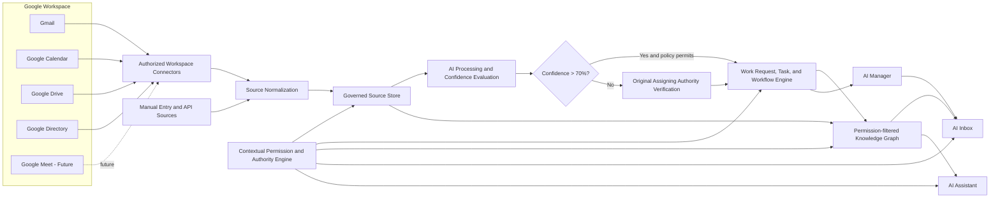
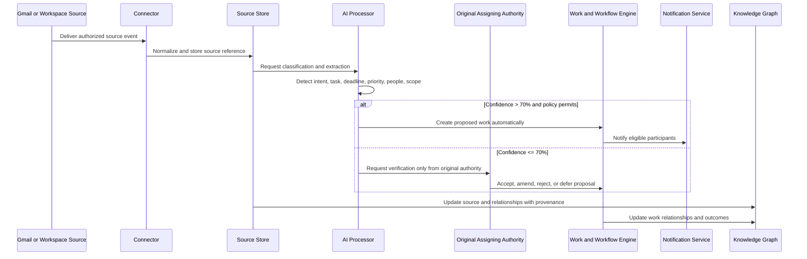
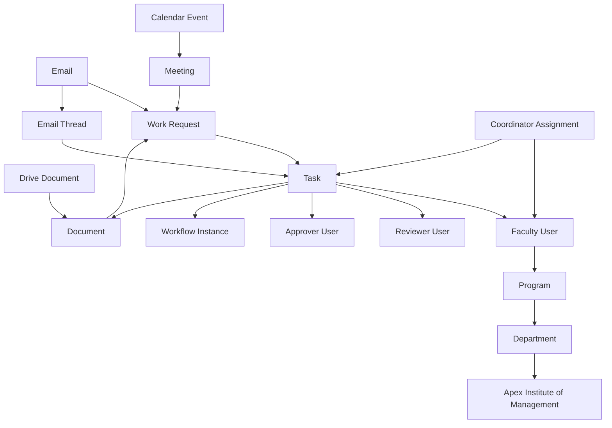

# ApexFlow AI: Google Workspace and AI Intelligence Domain

This document defines the AI communication architecture for ApexFlow AI and its planned Google Workspace integration. It is a documentation-only design and does not introduce backend, frontend, API, database, or migration changes.

Google Workspace authentication is already part of the platform foundation. The communication integrations and AI capabilities described here are future domain capabilities that must use least-privilege scopes, user consent or authorized domain delegation, contextual permissions, and auditable processing.

Supported Google Workspace systems are Gmail, Google Calendar, Google Drive, and Google Directory. Google Meet is a future integration.

## 1. Communication Sources

Communication sources become normalized source records that preserve the original evidence and can feed Work Requests, Tasks, workflows, summaries, and the knowledge graph.

| Source | Purpose |
| --- | --- |
| Email | Gmail messages, threads, recipients, attachments, labels, and delivery metadata. |
| Calendar | Google Calendar events, invitations, reminders, deadlines, and schedule changes. |
| Manual Entry | A user-created message, note, request, or task context recorded directly in ApexFlow. |
| Meeting Notes | Notes, action items, decisions, and attendance from a meeting or approved summary. |
| Drive Document | Google Drive document metadata and authorized content references used as work evidence or knowledge. |
| API | An approved inbound API integration that supplies structured communication or work events. |
| Future Integrations | Future systems such as Google Meet, WhatsApp, Teams, Slack, voice channels, or other approved connectors. |

Every source record carries its source type, external identifier, capture time, owner or author where known, organizational context, access classification, synchronization status, and immutable source reference. The connector must not duplicate content that is already represented by the same external identifier and version.

## 2. Gmail Intelligence

Gmail intelligence creates a governed representation of email communication while preserving thread context and sender/recipient relationships.

| Gmail element | Design use |
| --- | --- |
| Incoming Email | Captured as an inbound message with sender, recipients, headers, body reference, timestamp, and source mailbox context. |
| Outgoing Email | Captured as sent communication with sender identity, recipients, delivery state, and linked task or workflow context where available. |
| Reply Thread | Uses Gmail thread identity and message references to group related conversation without flattening individual message history. |
| CC | Preserved as visible copied recipients; may inform watchers or awareness suggestions but never automatically grants task authority. |
| BCC | Treated as restricted recipient metadata. It is not exposed in summaries, knowledge search, or task routing unless the viewer is separately authorized. |
| Attachments | Linked as immutable source artifacts with metadata, classification, checksum, and retention rules. |
| Labels | Synced or mapped into configurable ApexFlow categories, queues, or automation rules. |
| Importance | Gmail importance plus ApexFlow-derived urgency are stored separately; AI may suggest but not overwrite the original signal. |
| Categories | User- or policy-defined classification such as academic, examination, admission, placement, finance, or custom. |

Email ingestion respects mailbox ownership, Google scopes, retention requirements, and the permission model. A user can only view or search messages and attachments that their mailbox, delegated access, organizational context, and classification allow.

## 3. AI Email Processing

AI email processing produces proposed metadata and work actions from authorized email content. All output remains linked to the source message, extraction model/version, confidence, and verification decision.

| AI capability | Result |
| --- | --- |
| Email Classification | Proposes a category, sensitivity, queue, or business domain. |
| Intent Detection | Identifies likely intent such as request, information, approval, complaint, invitation, reminder, or escalation. |
| Task Detection | Identifies candidate work items, subtasks, dependencies, and checklist items. |
| Deadline Detection | Extracts stated or inferred dates, times, hard/soft deadline signals, and ambiguity. |
| Priority Detection | Proposes Critical, High, Medium, or Low priority with supporting evidence. |
| Assignee Detection | Proposes eligible assignees using named people, organizational context, active assignments, and workload. |
| Reviewer Detection | Proposes reviewers from task type, policy, program, department, or assignment context. |
| Approver Detection | Proposes authorized approvers from workflow policy and authority context. |
| Coordinator Detection | Identifies relevant active coordinator assignments, such as Exam, OBE, Placement, or Admission. |
| Department Detection | Resolves a likely owning department, such as AIT MBA or AIT BBA. |
| Program Detection | Resolves a likely academic program and, where applicable, batch or academic-session context. |

Detection is a recommendation, not an authorization grant. Proposed assignees, reviewers, approvers, coordinators, departments, and programs must be validated against active assignments, authority level, and resource scope before routing occurs.

## 4. AI Confidence

Each extraction has an overall Confidence Score and may have per-field confidence values. The score is recorded with the model/version, source, prompt or policy version where applicable, evaluation time, and evidence references.

| Confidence outcome | Processing rule |
| --- | --- |
| Greater than 70% | Automatic task or workflow creation may proceed only when the relevant policy permits it and all authorization checks pass. The result remains auditable and may still require a configured review or approval stage. |
| Less than or equal to 70% | Manual Verification is required. Verification routes only to the original assigning authority and is not automatically rerouted to the assignee, reviewer, approver, manager, coordinator, delegate, or escalation authority. |

**Automatic Processing** can classify, summarize, propose fields, create a permitted work request or task, attach source evidence, and send configured notifications. It cannot silently approve, complete, or override a workflow requiring human authority.

**Manual Verification** presents the source evidence, extracted fields, confidence, explanation, and proposed action to the original assigning authority. The authority can accept, amend, reject, or defer the proposal. That decision becomes part of the source and task audit trail.

## 5. AI Inbox

The AI Inbox is a personalized, permission-filtered operational view. It summarizes only resources the viewer is authorized to see and never elevates access through AI-generated content.

| Inbox area | Contents |
| --- | --- |
| Daily Summary | Concise, source-linked overview of relevant communication, tasks, workflow changes, and key risks since the last summary. |
| Priority Tasks | Open tasks ranked by priority, deadline, workflow state, authority, and configured relevance. |
| Pending Verification | Low-confidence AI proposals awaiting verification by the current user as original assigning authority. |
| Today's Deadlines | Soft and hard deadlines due today, with grace-period and escalation status. |
| Delayed Work | Overdue, blocked, or inactive tasks and workflows within the user's scope. |
| Suggested Actions | Non-binding recommendations such as create a task, request information, assign an eligible participant, schedule a meeting, or escalate a risk. |

The inbox records whether each suggestion was accepted, amended, dismissed, or ignored so that improvements can be evaluated without treating user behavior as an automatic authorization signal.

## 6. AI Manager

The AI Manager is an analytical assistant for authorized managers and coordinators. It forecasts operational risk and proposes actions; it does not independently change assignments, deadlines, authority, or workflow state.

| Capability | Analysis and output |
| --- | --- |
| Workload Prediction | Estimates upcoming work demand from assignments, teaching hours, tasks, reviews, approvals, deadlines, and historical effort. |
| Deadline Prediction | Identifies tasks at risk of missing soft or hard deadlines using current status, dependencies, capacity, and prior delivery patterns. |
| Conflict Detection | Detects scheduling, assignment, approval, workload, or dependency conflicts. |
| Risk Detection | Flags bottlenecks, blocked work, overdue approvals, missing information, concentration of authority, and compliance risk. |
| Faculty Capacity | Estimates available teaching and operational capacity across a faculty member's programs, batches, coordinator work, tasks, and availability. |
| Coordinator Capacity | Estimates active coordination load by coordinator type, period, scope, task volume, workflow duties, and deadlines. |

AI Manager outputs must expose the underlying source references and assumptions, distinguish observed facts from predictions, and offer recommended actions for a human to authorize.

## 7. AI Assistant

The AI Assistant provides natural-language discovery across sources that the requesting user is authorized to access. It returns source-linked answers, filters by organizational and classification scope, and does not disclose hidden email recipients, restricted documents, or unpermitted task data.

| Search capability | Scope |
| --- | --- |
| Natural Language Search | Answers questions using authorized, indexed communication and enterprise knowledge with cited source links. |
| Task Search | Finds authorized tasks by participant, type, status, priority, deadline, workflow, program, department, or related source. |
| Email Search | Finds authorized Gmail messages and threads by people, topic, label, time, importance, category, or linked work. |
| Document Search | Finds authorized Drive and knowledge-base documents by metadata, content, ownership, program, department, or relationship. |
| Knowledge Search | Traverses authorized relationships among work requests, tasks, people, departments, programs, documents, meetings, and communications. |

Search results must be permission-filtered before ranking and generation. Retrieval context is scoped to the user's active authorization context at query time.

## 8. Knowledge Graph

The Knowledge Graph is a governed relationship layer, not an unrestricted copy of enterprise content. It indexes stable identifiers, metadata, permitted content representations, and links among:

- Emails
- Tasks
- Work Requests
- Departments
- Programs
- Faculty
- Documents
- Meetings
- Relationships

Typical relationships include `email creates work request`, `work request creates task`, `task assigned to faculty`, `faculty belongs to program`, `program belongs to department`, `meeting produces action`, and `document supports task`. Each relationship records source, confidence when AI-derived, effective period where relevant, visibility scope, and audit metadata.

Knowledge updates are incremental and idempotent: an external source version updates the corresponding graph entity or relationship rather than producing duplicates. Access checks apply to both nodes and relationship traversal, so the graph cannot reveal a restricted connection indirectly.

## 9. Business Rules

- Gmail, Calendar, Drive, Directory, and future connector access uses the minimum approved scope and must be revocable.
- A communication source keeps its original external identifier, version, capture time, and source reference; repeated synchronization must not duplicate it.
- AI confidence greater than 70% permits only configured automatic processing after authorization. AI confidence less than or equal to 70% requires verification only by the original assigning authority.
- AI suggestions do not grant permissions, assign authority, approve work, or modify source evidence by themselves.
- Proposed assignees, reviewers, approvers, coordinators, departments, and programs require active contextual authorization before use.
- BCC data and restricted email/document content are excluded from broad search, summaries, and knowledge-graph traversal unless explicitly authorized.
- Notifications created from AI processing follow task, workflow, user-preference, classification, and escalation policies.
- AI-detected deadline, priority, risk, or escalation signals are recommendations until the configured workflow or authorized human action confirms them.
- Knowledge-graph updates retain source provenance, model/version, confidence, effective period, and visibility scope.
- AI Inbox and Assistant responses are generated only from resources the current user may access at query time.
- AI Manager predictions must distinguish inference from source facts and provide source-linked evidence for human review.
- All connector synchronization, AI extraction, verification, automated action, and knowledge update events are auditable.

## 10. Mermaid AI Architecture Diagram

## 11. Mermaid Communication Flow

## 12. Mermaid Knowledge Graph

## 13. Future Extensions

- **LLMs:** Support approved model providers and institution-selected models through a common evaluation, security, and audit layer.
- **Agents:** Introduce bounded AI agents that can use tools only within configured permissions, confidence thresholds, verification gates, and workflow policies.
- **RAG:** Add retrieval-augmented generation over permission-filtered Drive, knowledge-base, task, workflow, and communication sources with citations and freshness controls.
- **Voice:** Support authorized voice capture, transcription, action extraction, and meeting summaries with consent, verification, and retention controls.
- **WhatsApp:** Add an approved connector for messages and attachments with clear consent, source provenance, classification, and task-routing rules.
- **Teams:** Add Microsoft Teams communication, meeting, and file connectors using the same normalized-source and authorization model.
- **Slack:** Add Slack messages, threads, channels, and attachments as governed sources with channel-aware scope and retention controls.
